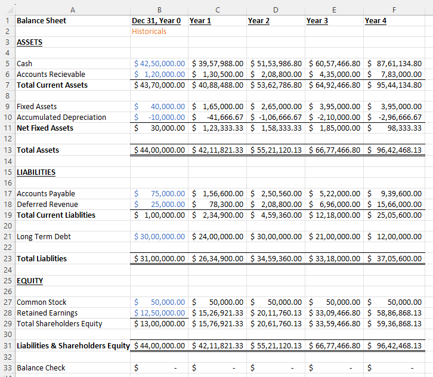
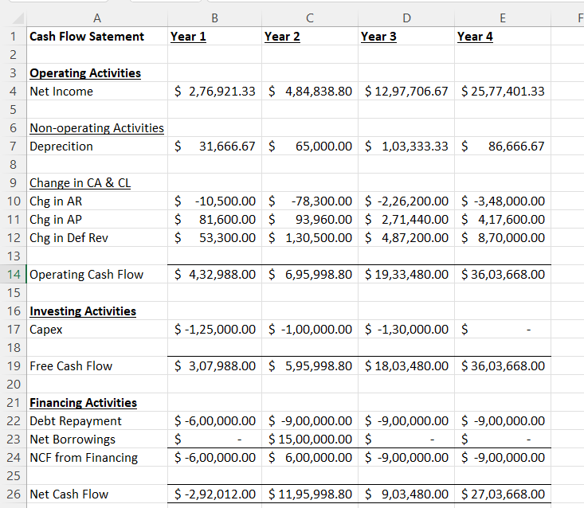
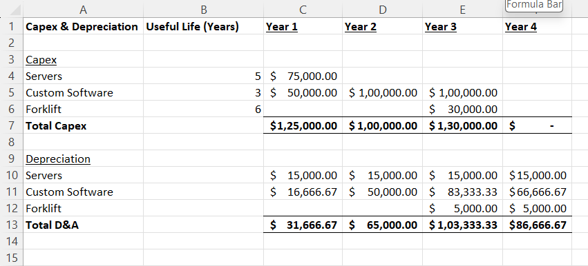

# 3-Statement Financial Model

## Overview
This project is a complete 3-statement financial model built in Microsoft Excel.

## Features
- Income Statement
- Balance Sheet
- Cash Flow Statement
- Linked financial statements
- Forecasting

## Tools Used
- Microsoft Excel
- Financial Modelling

## Skills Demonstrated
- Financial Analysis
- Forecasting
- Financial Modelling

## Preview

### Income Statement

### Balance Sheet

### Cash Flow Statement

### Capex & Depreciation

